# Icons

Icons are essential for marking spots on your map, and because of this it is important that you can mark the location
with the icons you think fits best.
In PocketMap, there are 150+ default icons. These icons are free to use and are coming
from [OpenMoji.org](http://openmoji.org/), an organisation that provides free to use open source emoji's.

## Adding custom icons

If you cannot find the right icon in the default icons, you can also add your own. You can add emoji's by adding png
files to the `makers/icons` folder or by providing an url.

### Adding icons using pngs

1. Add your png icon to the `markers/icons` folder
2. Open the `markers/icons/icons.json` file. This file contains a list with all the available icons.

```json5
[
  {
    "name": "performing_arts",
    "path": "openmoji/1F3AD"
  },
  {
    "name": "framed_picture",
    "path": "openmoji/1F5BC"
  },
  // ...
]
```

3. Add your icon to the list by adding an object with the name, this is the UNIQUE identifier of the icon, and the path,
   the location INSIDE the `markers/icons` folder.
    - your file is located at: `markers/icons/myicon.png`, the path is `myicon`.
    - Your file is located at: `markers/icons/myicons/myicon.png`, the path is `myicons/myicon`

```json5
{
  "name": "<icon_name>",
  // the name of the icon by which it is identified
  "path": "<icon_path>"
  // the path INSIDE the icons folder
}
```

### Adding icons using urls

1. Open the `markers/icons.json` file. This file contains a list with all the available icons.
2. Add your icon to the list by adding an object with the name, this is the UNIQUE identifier of the icon, and the url
   of the icon.

```json5
{
  "name": "<icon_name>", // the name of the icon by which it is identified
  "url": "<url>" // url of the image
}
```

## Default icons

You can find all the default icons [here](icons_table.md)

### OpenMoji Icons

> All icons are designed by [OpenMoji](https://openmoji.org/) – the open-source emoji and icon project.
> License: [CC BY-SA 4.0](https://creativecommons.org/licenses/by-sa/4.0/#)

|                                                                                                                            |                                                                                                                          |                                                                                                                      |                                                                                                                          |                                                                                                                              |                                                                                                                        |                                                                                                                          |                                                                                                                      |                                                                                                                          |                                                                                                                              |
|----------------------------------------------------------------------------------------------------------------------------|--------------------------------------------------------------------------------------------------------------------------|----------------------------------------------------------------------------------------------------------------------|--------------------------------------------------------------------------------------------------------------------------|------------------------------------------------------------------------------------------------------------------------------|------------------------------------------------------------------------------------------------------------------------|--------------------------------------------------------------------------------------------------------------------------|----------------------------------------------------------------------------------------------------------------------|--------------------------------------------------------------------------------------------------------------------------|------------------------------------------------------------------------------------------------------------------------------|
| performing_arts<br>[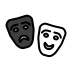](https://openmoji.org/library/emoji-1F3AD/) | artist_palette<br>[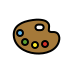](https://openmoji.org/library/emoji-1F3A8/) | trophy<br>[](https://openmoji.org/library/emoji-1F3C6/)             | jack-o-lantern<br>[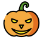](https://openmoji.org/library/emoji-1F383/) | christmas_tree<br>[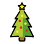](https://openmoji.org/library/emoji-1F384/)     | fireworks<br>[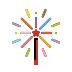](https://openmoji.org/library/emoji-1F386/)         | firecracker<br>[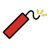](https://openmoji.org/library/emoji-1F9E8/)       | sparkles<br>[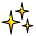](https://openmoji.org/library/emoji-2728/)           | balloon<br>[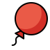](https://openmoji.org/library/emoji-1F388/)               | party_popper<br>[](https://openmoji.org/library/emoji-1F389/)         |
| wrapped_gift<br>[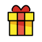](https://openmoji.org/library/emoji-1F381/)       | ticket<br>[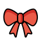](https://openmoji.org/library/emoji-1F380/)                 | bullseye<br>[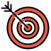](https://openmoji.org/library/emoji-1F3AF/)         | kite<br>[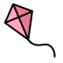](https://openmoji.org/library/emoji-1FA81/)                     | crystal_ball<br>[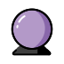](https://openmoji.org/library/emoji-1F52E/)         | magic_wand<br>[](https://openmoji.org/library/emoji-1FA84/)       | game_die<br>[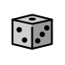](https://openmoji.org/library/emoji-1F3B2/)             | puzzle_piece<br>[](https://openmoji.org/library/emoji-1F9E9/) | teddy_bear<br>[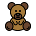](https://openmoji.org/library/emoji-1F9F8/)         | pinata<br>[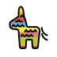](https://openmoji.org/library/emoji-1FA85/)                     |
| spade_suit<br>[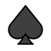](https://openmoji.org/library/emoji-2660/)             | heart_suit<br>[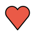](https://openmoji.org/library/emoji-2665/)           | diamond_suit<br>[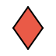](https://openmoji.org/library/emoji-2666/)   | club_suit<br>[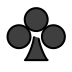](https://openmoji.org/library/emoji-2663/)             | chess_pawn<br>[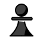](https://openmoji.org/library/emoji-265F/)               | fishing_pole<br>[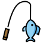](https://openmoji.org/library/emoji-1F3A3/)   | tree<br>[](https://openmoji.org/library/emoji-1F333/)                     | cactus<br>[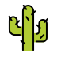](https://openmoji.org/library/emoji-1F335/)             | chequered_flag<br>[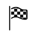](https://openmoji.org/library/emoji-1F3C1/) | triangular_flag<br>[](https://openmoji.org/library/emoji-1F6A9/)   |
| black_flag<br>[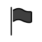](https://openmoji.org/library/emoji-1F3F4/)           | white_flag<br>[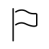](https://openmoji.org/library/emoji-1F3F3/)         | books<br>[](https://openmoji.org/library/emoji-1F4DA/)               | scroll<br>[](https://openmoji.org/library/emoji-1F4DC/)                 | bookmark<br>[](https://openmoji.org/library/emoji-1F516/)                 | door<br>[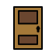](https://openmoji.org/library/emoji-1F6AA/)                   | window<br>[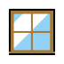](https://openmoji.org/library/emoji-1FA9F/)                 | bed<br>[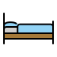](https://openmoji.org/library/emoji-1F6CF/)                   | camera<br>[](https://openmoji.org/library/emoji-1F4F7/)                 | magnifying_glass<br>[](https://openmoji.org/library/emoji-1F50D/) |
| candle<br>[](https://openmoji.org/library/emoji-1F56F/)                   | light_bulb<br>[](https://openmoji.org/library/emoji-1F4A1/)         | locked<br>[](https://openmoji.org/library/emoji-1F512/)             | unlocked<br>[](https://openmoji.org/library/emoji-1F513/)             | key<br>[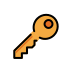](https://openmoji.org/library/emoji-1F511/)                           | old_key<br>[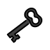](https://openmoji.org/library/emoji-1F5DD/)             | envelope<br>[](https://openmoji.org/library/emoji-2709/)               | package<br>[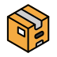](https://openmoji.org/library/emoji-1F4E6/)           | money_bag<br>[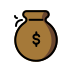](https://openmoji.org/library/emoji-1F4B0/)           | coin<br>[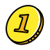](https://openmoji.org/library/emoji-1FA99/)                         |
| note<br>[](https://openmoji.org/library/emoji-1F3B5/)                       | calendar<br>[](https://openmoji.org/library/emoji-1F4C5/)             | clipboard<br>[](https://openmoji.org/library/emoji-1F4CB/)       | pin<br>[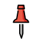](https://openmoji.org/library/emoji-1F4CC/)                       | round_pin<br>[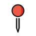](https://openmoji.org/library/emoji-1F4CD/)               | paperclip<br>[](https://openmoji.org/library/emoji-1F4CE/)         | coffin<br>[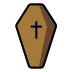](https://openmoji.org/library/emoji-26B0/)                   | headstone<br>[](https://openmoji.org/library/emoji-1FAA6/)       | placard<br>[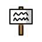](https://openmoji.org/library/emoji-1FAA7/)               | moai<br>[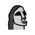](https://openmoji.org/library/emoji-1F5FF/)                         |
| telescope<br>[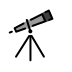](https://openmoji.org/library/emoji-1F52D/)             | test_tube<br>[](https://openmoji.org/library/emoji-1F9EA/)           | bell<br>[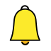](https://openmoji.org/library/emoji-1F514/)                 | hammer<br>[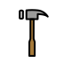](https://openmoji.org/library/emoji-1F528/)                 | axe<br>[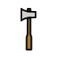](https://openmoji.org/library/emoji-1FA93/)                           | pickaxe<br>[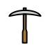](https://openmoji.org/library/emoji-26CF/)               | hammer_and_pick<br>[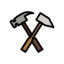](https://openmoji.org/library/emoji-2692/) | sword<br>[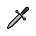](https://openmoji.org/library/emoji-1F5E1/)               | crossed_swords<br>[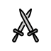](https://openmoji.org/library/emoji-2694/)   | bow_and_arrow<br>[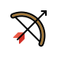](https://openmoji.org/library/emoji-1F3F9/)       |
| shield<br>[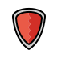](https://openmoji.org/library/emoji-1F6E1/)                   | gear<br>[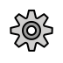](https://openmoji.org/library/emoji-2699/)                       | balance_scale<br>[](https://openmoji.org/library/emoji-2696/) | chains<br>[](https://openmoji.org/library/emoji-26D3/)                   | ladder<br>[](https://openmoji.org/library/emoji-1FA9C/)                     | pencil<br>[](https://openmoji.org/library/emoji-270F/)                 | up<br>[](https://openmoji.org/library/emoji-2B06/)                           | up-right<br>[](https://openmoji.org/library/emoji-2197/)           | right<br>[](https://openmoji.org/library/emoji-27A1/)                     | down-right<br>[](https://openmoji.org/library/emoji-2198/)               |
| down<br>[](https://openmoji.org/library/emoji-2B07/)                         | down-left<br>[](https://openmoji.org/library/emoji-2199/)             | left<br>[](https://openmoji.org/library/emoji-2B05/)                   | up-left<br>[](https://openmoji.org/library/emoji-2196/)                 | shuffle<br>[](https://openmoji.org/library/emoji-1F500/)                   | dollar<br>[](https://openmoji.org/library/emoji-1F4B2/)               | orange_circle<br>[](https://openmoji.org/library/emoji-1F7E0/)   | blue_circle<br>[](https://openmoji.org/library/emoji-1F535/)   | orange_square<br>[](https://openmoji.org/library/emoji-1F7E7/)   | blue_square<br>[](https://openmoji.org/library/emoji-1F7E6/)           |
| orange_diamond<br>[](https://openmoji.org/library/emoji-1F536/)   | blue_diamond<br>[](https://openmoji.org/library/emoji-1F537/)     | triangle_up<br>[](https://openmoji.org/library/emoji-1F53A/)   | triangle_down<br>[](https://openmoji.org/library/emoji-1F53B/)   | diamond_with_dot<br>[](https://openmoji.org/library/emoji-1F4A0/) | hollow_circle<br>[](https://openmoji.org/library/emoji-2B55/)   | check<br>[](https://openmoji.org/library/emoji-2714/)                     | cross<br>[](https://openmoji.org/library/emoji-274C/)                 | worship<br>[](https://openmoji.org/library/emoji-1F9D0/)               | atom<br>[](https://openmoji.org/library/emoji-269B/)                           |
| yin_yang<br>[](https://openmoji.org/library/emoji-262F/)                 | peace<br>[](https://openmoji.org/library/emoji-262E/)                     | warning<br>[](https://openmoji.org/library/emoji-26A0/)             | no_entry<br>[](https://openmoji.org/library/emoji-26D4/)               | prohibited<br>[](https://openmoji.org/library/emoji-1F6AB/)             | radioactive<br>[](https://openmoji.org/library/emoji-2622/)       | biohazard<br>[](https://openmoji.org/library/emoji-2623/)             | world<br>[](https://openmoji.org/library/emoji-1F30D/)               | meridians<br>[](https://openmoji.org/library/emoji-1F310/)           | compass<br>[](https://openmoji.org/library/emoji-1F9ED/)                   |
| mountain<br>[](https://openmoji.org/library/emoji-26F0/)                 | camping<br>[](https://openmoji.org/library/emoji-1F3D5/)               | beach<br>[](https://openmoji.org/library/emoji-1F3D6/)               | desert<br>[](https://openmoji.org/library/emoji-1F3DC/)                 | island<br>[](https://openmoji.org/library/emoji-1F3DD/)                     | national_park<br>[](https://openmoji.org/library/emoji-1F3DE/) | stadium<br>[](https://openmoji.org/library/emoji-1F3DF/)               | monument<br>[](https://openmoji.org/library/emoji-1F3DB/)         | construction<br>[](https://openmoji.org/library/emoji-1F3D7/)     | brick<br>[](https://openmoji.org/library/emoji-1F9F1/)                       |
| rock<br>[](https://openmoji.org/library/emoji-1FAA8/)                       | wood<br>[](https://openmoji.org/library/emoji-1FAB5/)                     | hut<br>[](https://openmoji.org/library/emoji-1F6D6/)                   | houses<br>[](https://openmoji.org/library/emoji-1F3D8/)                 | derelict_house<br>[](https://openmoji.org/library/emoji-1F3DA/)     | house<br>[](https://openmoji.org/library/emoji-1F3E0/)                 | office<br>[](https://openmoji.org/library/emoji-1F3E2/)                 | hospital<br>[](https://openmoji.org/library/emoji-1F3EF/)         | bank<br>[](https://openmoji.org/library/emoji-1F3E6/)                     | school<br>[](https://openmoji.org/library/emoji-1F3EB/)                     |
| store<br>[](https://openmoji.org/library/emoji-1F3EC/)                     | factory<br>[](https://openmoji.org/library/emoji-1F3ED/)               | castle<br>[](https://openmoji.org/library/emoji-1F3F0/)             | church<br>[](https://openmoji.org/library/emoji-26EA/)                   | fountain<br>[](https://openmoji.org/library/emoji-26F2/)                   | tent<br>[](https://openmoji.org/library/emoji-26FA/)                     | city<br>[](https://openmoji.org/library/emoji-1F3D9/)                     | playground<br>[](https://openmoji.org/library/emoji-1F6DD/)     | circus<br>[](https://openmoji.org/library/emoji-1F3AA/)                 | train<br>[](https://openmoji.org/library/emoji-1F686/)                       |
| car<br>[](https://openmoji.org/library/emoji-1F697/)                         | traffic_light<br>[](https://openmoji.org/library/emoji-1F6A6/)   | anchor<br>[](https://openmoji.org/library/emoji-2693/)               | canoe<br>[](https://openmoji.org/library/emoji-1F6F6/)                   | airplane<br>[](https://openmoji.org/library/emoji-2708/)                   | satellite<br>[](https://openmoji.org/library/emoji-1F6F0/)         | rocket<br>[](https://openmoji.org/library/emoji-1F680/)                 | moon<br>[](https://openmoji.org/library/emoji-1F319/)                 | sun<br>[](https://openmoji.org/library/emoji-2600/)                         | star<br>[](https://openmoji.org/library/emoji-2B50/)                           |
| cloud<br>[](https://openmoji.org/library/emoji-2601/)                       | rainbow<br>[](https://openmoji.org/library/emoji-1F308/)               | high_voltage<br>[](https://openmoji.org/library/emoji-26A1/)   | snowflake<br>[](https://openmoji.org/library/emoji-2744/)             | fire<br>[](https://openmoji.org/library/emoji-1F525/)                         | signpost<br>[](https://openmoji.org/library/emoji-E094/)             | transmission<br>[](https://openmoji.org/library/emoji-E0A1/)       | location<br>[](https://openmoji.org/library/emoji-E0A9/)           | bread<br>[](https://openmoji.org/library/emoji-E0CA/)                     | town<br>[](https://openmoji.org/library/emoji-E203/)                           |

### Custom Icons

There are no custom icons, but maybe in the future.